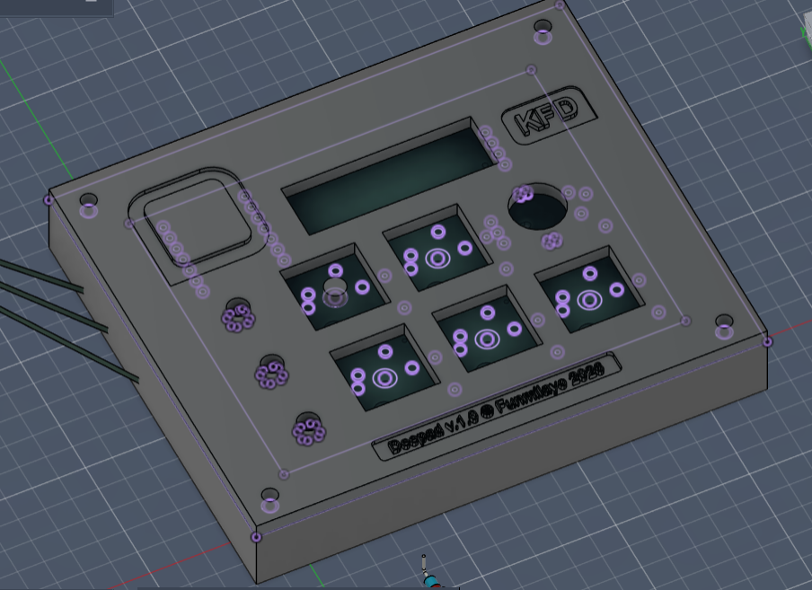
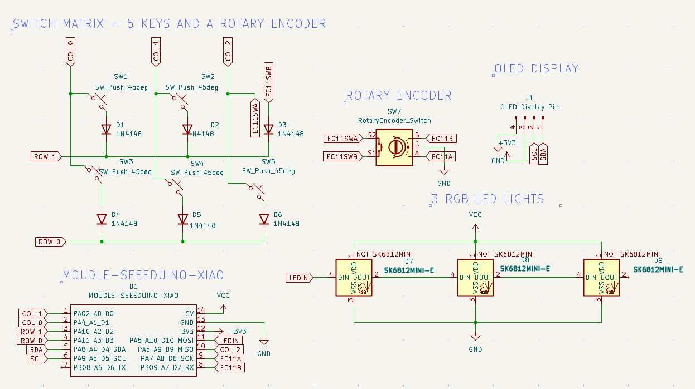
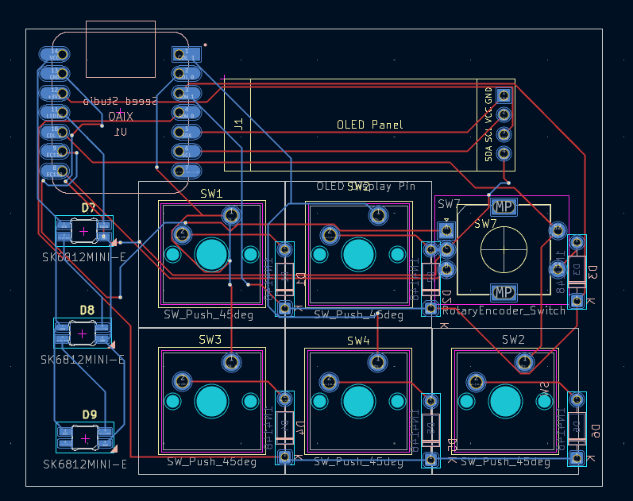
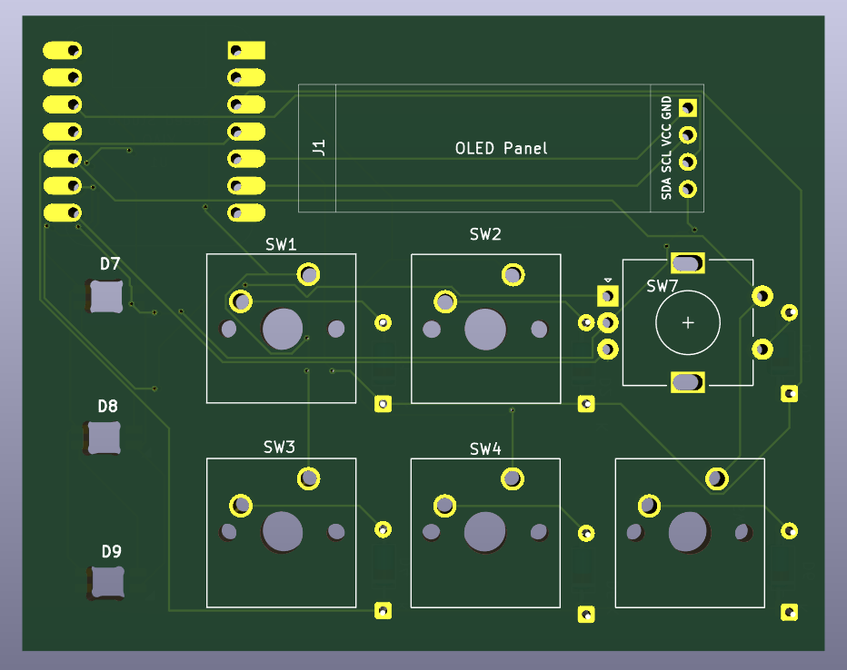
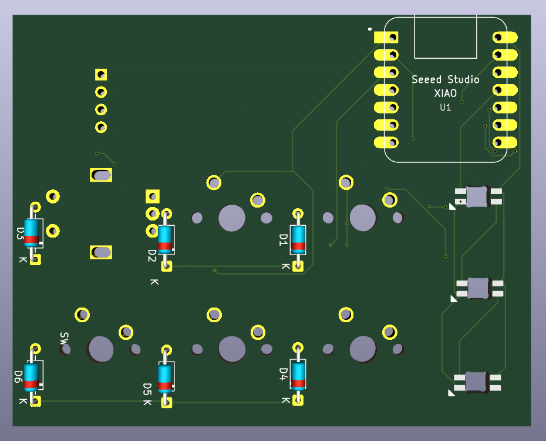

This is the clean folder (omiting junk and system files) for https://github.com/Dee-24r/My_Hackpad (which I'm still pushing files to by the way).

# Deepad
This repo contains the design files (electrical and cad) for deepad v.1.0, :) my first ever macropad.

## Overview
  
My macropad contains 5 key switches, a rotary encoder with a switch, an OLED display, and 3 RGB LEDs. It uses the [SEEED Xiao RP2040](https://wiki.seeedstudio.com/XIAO-RP2040/) microcontroller.

## Repo info

This repo mainly contains the schematic and pcb designs (along with the (custom) symbol and footprint libraries used), the case and pcb cad designs (in .STEP files), gerber files for pcb production (gerber.zip), and the firmware for the macropad. There is also an image folder (If you're scooping around, this is what you should open - it contains screenshots of every important file/design, and so does this README).

### Repo content

[Go to cad files](deepad_cad/) 
[Go to firmware](deepad_firmware/) 
[Go to schematic and pcb](deepad_sch_and_pcb/) 
[View screenshot of all files](images/) This is where you want to go!

### README content

[How I made my macropad](#making-my-macropad---with-pics) 
[Bill of Materials](#-bill-of-materials-bom)

## Making my macropad - with pics
This is my first time creating a macropad. Here are the components I've designed it with:
- 1x unsoldered Seeed XIAO RP2040 - the microcontroller
- 5x MX-Style switches - basically keys (keyboard keys)
- 1x EC11 Rotary encoder - it's like a knob and produces rotational value
- 1x 0.91 inch OLED display - display screen
- 5x white blank DSA keycaps - keycaps for the keys
- 3x SK6812 MINI-E LEDs - these are rgb leds
- 4x M3x16mm screws - for screwing my top and bottom case together
- 4x M3x5mx4mm heatset inserts - same as last one - they go together

I began by designing the schematic and pcb. I added all my components and wired them.

Next, I assigned footprints, and updated my PCB. I wired the PCB and learned to use vias. After wiring, I added the edge cuts and exported my STEP file to use in Fusion 360.

And these are 3d views of the pcb (front and back)

BRUH! The way I'm just listing steps and you're probably thinking everything went smooth and step by step <3. This was not the case!

Fusion 360 was a hassle! It's not a bad software; I just didn't know how to use it. But I'm glad I learned.

I started by drawing rectangles for the base of my case, adding holes for the screws and then extruding the shape - outer part of the case is 13mm deep and the inner is 3mm thick. I then attached my PCB .step file to "project" (I had so much trouble understanding how this worked) but got through it anyways. I projected my base case (not recursion :|) to make my top case, which was also 3mm thick. I rounded all my edges a bit and then added the holes for the keys and other components. Finally I added the usb cutout and extruded all holes. I later came back to add a few text decorations to the design (creative enough -- chee!) Here's my full cad design:

Next stage was the firmware! You can open up [the firmware folder](deepad_firmware/) to see all the code. It conatins the keyboard.json, rules.mk, config.h, and keymap.c files (keymap.c will still be edited to match my key functions).

I used QMK MSYS to create the folder and then edited the code to match my keys and board. And that was it!

Everything I did, I did with the help of many friends in the statis and blueprint channels, and with much *searching online and asking AI many many many questions*. I'm happy with my work and I can't wait to start assembling and soldering.

## Macropad use
I decided to make this project because I admire building hardware projects. My first idea for the controls are Git commands in VSCode or any other IDE (e.g. buttons to stage, to commit, push, pull, and more). I plan to have the RGB LEDs indicate information like the status of your branch. Same for the OLED display.

I also would love to see what I can do with this when I hack up a game - (coming soon)! My macropad is made compatible with via, so I'll be using it for many things for sure.

**More updates on next steps coming soon.**

Big Thank you to [Statis](https://statis.hackclub.com), one of [Hack Club's](https://hackclub.com) events. They're funding this project and many more by paying for all components. Thanks Hack Club, Thanks Statis.

## Bill of Materials (BOM)

| Name | Quantity | Cost Per Item (USD) | Total (USD) | Purpose | Distributor | Link |
|------|----------|---------------------|-------------|---------|-------------|------|
| 3D printed case | 1 | $6.00 | $6.00 | The case for my macropad | Printing Legion | [Link](https://app.slack.com/client/E09V59WQY1E/C083P4FJM46) |
| PCB fabrication and shipping | 1 | $6.32 | $6.32 | My fabricated pcb - the base for my macropad | JLCPCB | [Link](https://trade.jlcpcb.com/checkout/payMethod/?unionSettleId=ef6227353eb342a4b2aa266e4f1f0516&systemType=order_pcb&orderTypes=order_pcb&calType=PRE_CAL&couponDemo=1&spm=Jlcpcb.Partcart.1002) |
| Ali Express shipping and fees | 1 | $2.27 | $2.27 | Shipping | Ali Express | [Link](https://www.aliexpress.us/p/trade/confirm.html?availableProductShopcartIds=81025195134366,81025054474920,81025239479329,81025054362285,81025088699059,81025088643368&aeOrderFrom=main_shopcart&intentionalPayMethod=&curPageLogUid=1774064517052_SwJmHd&spm=a2g0o.cart.0.0) |
| Digikey tax and shipping | 1 | $7.84 | $7.84 | Shipping | Digikey | [Link](https://www.digikey.com/ordering/Ship) |
| M3x5mx4mm heatset inserts | 99 | $0.01 | $0.99 | secure threading for the M3 screw | Ali Express | [Link](https://www.aliexpress.us/item/2255800046543591.html) |
| M3x16mm screws | 10 | $0.104 | $1.04 | Secures top and bottom parts of the cases together | Ali Express | [Link](https://www.aliexpress.us/item/3256805692722422.html?spm=a2g0o.productlist.main.15.6bdaXiwWXiwW4C&utparam-url=scene%3Asearch%7Cquery_from%3Apc_back_same_best%7Cx_object_id%3A1005005879037174%7C_p_origin_prod%3A&algo_pvid=056d9f9f-cd17-4a96-b4b5-7e28a3cb7079&algo_exp_id=056d9f9f-cd17-4a96-b4b5-7e28a3cb7079&pdp_ext_f=%7B%22order%22%3A%2239378%22%2C%22fromPage%22%3A%22search%22%7D&pdp_npi=6%40dis%21USD%211.11%210.99%21%21%211.11%210.99%21%402101f11417740613553598176ea51c%2112000034679037238%21sea%21US%217455183214%21ABX%211%210%21n_tag%3A-29910%3Bd%3A4adcddb6%3Bm03_new_user%3A-29895%3BpisId%3A5000000197847491&gatewayAdapt=4itemAdapt) |
| 1u Key caps | 10 | $0.233 | $2.33 | The covering for the keys | Ali Express | [Link](https://www.aliexpress.us/item/3256807312571573.html?pdp_npi=4%40dis%21USD%212.36%212.23%21%21%21%21%21%40%2112000041033351612%21ppc%21%21%21&utm_source=chatgpt.com&gatewayAdapt=glo2usa) |
| 5-pin PCB-mount switch | 10 | $0.268 | $2.68 | The keyboard keys | Ali Express | [Link](https://www.aliexpress.us/item/3256806239135691.html?spm=a2g0o.productlist.main.1.555cY61VY61Voz&algo_pvid=f4678bb1-d8bc-4f13-acc6-d405ddda900a&algo_exp_id=f4678bb1-d8bc-4f13-acc6-d405ddda900a-0&pdp_ext_f=%7B%22order%22%3A%222257%22%2C%22spu_best_type%22%3A%22price%22%2C%22eval%22%3A%221%22%2C%22fromPage%22%3A%22search%22%7D&pdp_npi=6%40dis%21USD%212.96%210.99%21%21%2120.28%216.79%21%40210319b017740604574907332ebb44%2112000037120671469%21sea%21US%217455183214%21ABX%211%210%21n_tag%3A-29910%3Bd%3A4adcddb6%3Bm03_new_user%3A-29895%3BpisId%3A5000000197847458&curPageLogUid=wFaqavLZ7pag&utparam-url=scene%3Asearch%7Cquery_from%3A%7Cx_object_id%3A1005006425450443%7C_p_origin_prod%3A) |
| 5V SK6812MINI-E rgb leds | 10 | $0.283 | $2.83 | Shows colours to indicate signals | Ali Express | [Link](https://www.aliexpress.us/item/3256805154503907.html?spm=a2g0o.cart.0.0.255738daUjnIZC&mp=1&pdp_npi=6%40dis%21USD%21USD%203.88%21USD%202.83%21%21USD%202.83%21%21%21%40210328d417740598605087437e76d7%2112000032670306832%21ct%21US%217455183214%21%211%210%21&_gl=1*ctc1p2*_gcl_aw*R0NMLjE3NzQwNTk2MzMuQ2owS0NRanc0UFBOQmhEOEFSSXNBTW8taWN6aTRJXzhFRUkxVTdYOW5nZHUwR3F6SnFwb29VemlmOGJaQUV5dkF0b2ZXS0tSU0NqTUFya2FBbVZsRUFMd193Y0I.*_gcl_dc*R0NMLjE3NzQwNTk2MzMuQ2owS0NRanc0UFBOQmhEOEFSSXNBTW8taWN6aTRJXzhFRUkxVTdYOW5nZHUwR3F6SnFwb29VemlmOGJaQUV5dkF0b2ZXS0tSU0NqTUFya2FBbVZsRUFMd193Y0I.*_gcl_au*MTM5MDY2MTQ1Ny4xNzc0MDIzODky*_ga*Njc2OTI3NDYwMTEwMDc2LjE3NzQwMjM4ODg0ODQ.*_ga_VED1YSGNC7*czE3NzQwNTc2MzgkbzQkZzEkdDE3NzQwNTk4NjIkajUyJGwwJGgw&gatewayAdapt=glo2usa) |
| 0.91 inch SSD1306 I2C 128x32 OLED display | 1 | $1.79 | $1.79 | Displays information and animations | Ali Express | [Link](https://www.alibaba.com/product-detail/p_1601269142088.html?mark=google_shopping&src=sem_ggl&field=UG&from=sem_ggl&cmpgn=22635874527&adgrp=177485315221&fditm=&tgt=pla-2412849993011&locintrst=&locphyscl=9004156&mtchtyp=&ntwrk=g&device=c&dvcmdl=&creative=756472634791&plcmnt=&plcmntcat=&aceid=&position=&gad_source=1&gad_campaignid=22635874527&gbraid=0AAAAAD8m77rp5yq_D4sar09dZwjHf38Ff&gclid=Cj0KCQjw4PPNBhD8ARIsAMo-icwRKX-Xv21XhIKf2XLIr8hZsyZziY9LSFWxOIcTT2RBpsQoYdHkvzMaAqqmEALw_wcB) |
| EC11E Rotary encoder | 1 | $4.49 | $4.49 | Rotational input and a push button | Digikey | [Link](https://www.digikey.com/en/products/detail/alps-alpine/EC11E18244AU/19529126?gclsrc=aw.ds&gad_source=1&gad_campaignid=20232005509&gbraid=0AAAAADrbLlifC6Ul36d-VkrbtfLhzJR3A&gclid=Cj0KCQjw4PPNBhD8ARIsAMo-icwL1v2j2vQ0BAVcN0WAmoQCDdEUydAJI7PHbfwijbrCT8AFN1RY1LgaAoCLEALw_wcB) |
| Seed Xiao - RP2040 | 1 | $4.68 | $4.68 | Microcontroller - the power source and control | Digikey | [Link](https://www.digikey.com/en/products/detail/seeed-technology-co-ltd/102010428/14672129?_gl=1*1r8i03x*_up*MQ..*_gs*MQ..&gclid=Cj0KCQjw4PPNBhD8ARIsAMo-icy7fxEGVXRWNO1l1mCxLzWxMUG9XpG8Jsqtt5rJFCJy08k6NiEjTFkaAgcKEALw_wcB&gclsrc=aw.ds&gbraid=0AAAAADrbLlhaXQosLL-XQuB1QAiKI9YAR) |
| 1N4148 D0-35 diodes | 10 | $0.047 | $0.47 | To use with my switches in the key matrix | Digikey | [Link](https://www.digikey.com/en/products/detail/onsemi/1N4148/458603)

**Total cost: $43.73**